# CLAUDE.md

This file provides guidance to Claude Code (claude.ai/code) when working with code in this repository.

---

## 变更记录 (Changelog)

### 2025-12-14
- **初始化 AI 上下文文档**：完成项目架构扫描和模块文档生成
- **新增模块结构图**：使用 Mermaid 可视化模块关系
- **新增模块索引**：每个核心模块都有独立的 `CLAUDE.md` 文档
- **新增 `.claude/index.json`**：记录项目结构、模块清单和扫描元数据

---

## 项目愿景

Smart Draw is an AI-powered diagram generation tool that supports two rendering engines (Draw.io and Excalidraw). Users describe diagrams in natural language, and LLMs generate the corresponding XML (Draw.io) or JSON (Excalidraw) code, which is then rendered on an interactive canvas.

**核心价值**：
- **零学习成本**：自然语言描述即可生成专业图表
- **双引擎支持**：Draw.io（传统图表）+ Excalidraw（手绘风格）
- **所见即所得**：实时预览、代码可编辑、历史可恢复
- **灵活配置**：支持本地 API Key 和团队共享密码模式

**Tech Stack:** Next.js 16 (App Router) · React 19 · Draw.io · Excalidraw · Tailwind CSS 4 · Monaco Editor

---

## 模块结构图

```mermaid
graph TD
    ROOT["(根) Smart Draw"] --> APP["app/"]
    ROOT --> HOOKS["hooks/"]
    ROOT --> COMPONENTS["components/"]
    ROOT --> LIB["lib/"]
    ROOT --> DOCS["docs/"]

    APP --> APP_PAGES["页面路由"]
    APP --> APP_API["API 路由"]
    APP_PAGES --> APP_DRAW["draw/page.js"]
    APP_API --> APP_LLM_STREAM["api/llm/stream"]
    APP_API --> APP_LLM_CONFIG["api/llm/config"]

    HOOKS --> HOOKS_ENGINE["useEngine.js"]
    HOOKS --> HOOKS_DRAWIO["useDrawioEngine.js"]
    HOOKS --> HOOKS_EXCALIDRAW["useExcalidrawEngine.js"]
    HOOKS --> HOOKS_SHARED["useEngineShared.js"]

    COMPONENTS --> COMP_CANVAS["画布组件"]
    COMPONENTS --> COMP_UI["UI 组件库"]
    COMP_CANVAS --> COMP_DRAWIO["DrawioCanvas.jsx"]
    COMP_CANVAS --> COMP_EXCALI["ExcalidrawCanvas.jsx"]
    COMP_UI --> COMP_CHAT["FloatingChat.jsx"]
    COMP_UI --> COMP_EDITOR["FloatingCodeEditor.jsx"]

    LIB --> LIB_LLM["llm-client.js"]
    LIB --> LIB_PROCESSOR["code-processor.js"]
    LIB --> LIB_FIX["fixUnclosed.js"]
    LIB --> LIB_OPTIMIZE["optimizeArrows.js"]
    LIB --> LIB_CONFIG["config-manager.js"]
    LIB --> LIB_HISTORY["history-manager.js"]
    LIB --> LIB_PROMPTS["prompts/"]

    click APP "./app/CLAUDE.md" "查看 app 模块文档"
    click HOOKS "./hooks/CLAUDE.md" "查看 hooks 模块文档"
    click COMPONENTS "./components/CLAUDE.md" "查看 components 模块文档"
    click LIB "./lib/CLAUDE.md" "查看 lib 模块文档"
```



---

## 架构总览

### Dual-Engine System (双引擎系统)

The application implements a **Strategy Pattern** for diagram engines:

- **Engine Selection:** `hooks/useEngine.js` dynamically returns either `useDrawioEngine` or `useExcalidrawEngine` based on runtime `engineType` state
- **Engine Interface (IEngine):** Each engine hook exposes:
  - `usedCode`: XML (Draw.io) or JSON (Excalidraw) applied to canvas
  - `messages`: LLM message history
  - `isGenerating`: generation state flag
  - `streamingContent`: real-time streaming content from LLM
  - `conversationId`: unique conversation identifier
  - `handleSendMessage()`: send user input to LLM
  - `handleApplyCode()`: apply generated code to canvas
  - `handleCanvasChange()`: handle user edits on canvas
  - `handleNewChat()`: reset conversation state
  - `handleRestoreHistory()`: restore from history

### LLM Integration Flow (LLM 集成流程)

**Frontend → Backend Proxy → LLM Provider:**

1. **Frontend** (`hooks/useDrawioEngine.js` or `hooks/useExcalidrawEngine.js`):
   - Constructs complete `messages` array with system prompt + user prompt
   - Reads active config via `getConfig()` from `lib/config.js`
   - POSTs `{ config, messages }` to `/api/llm/stream`

2. **Backend Proxy** (`app/api/llm/stream/route.js`):
   - Validates `config` and `messages`
   - Calls `callLLM()` from `lib/llm-client.js`
   - Returns SSE (Server-Sent Events) stream: `data: {"content": "..."}\n\n`
   - Terminates with `data: [DONE]\n\n`

3. **LLM Client** (`lib/llm-client.js`):
   - Supports OpenAI and Anthropic APIs
   - Handles streaming responses and multimodal content (text + images)
   - Normalizes different provider formats

### Configuration System (配置系统)

**Multi-config + Access Password:**

- **Local Configs:** Managed by `lib/config-manager.js` (CRUD operations in `localStorage`)
- **Remote Config:** When access password is enabled, backend config is fetched and stored in `localStorage` as `smart-diagram-remote-config`
- **Active Config Resolution:** `lib/config.js` → `getConfig()` returns the final effective config:
  - If `smart-diagram-use-password === 'true'`: use remote config
  - Otherwise: use active local config from `config-manager.js`
- All components call `getConfig()` to get the current LLM configuration

### Code Post-Processing (代码后处理)

**Draw.io (XML):**
- Extract from code fences: `` ```xml ... ``` ``
- Fix unclosed tags: `lib/fixUnclosed.js` repairs malformed XML
- Clean BOM and zero-width characters
- Function: `postProcessDrawioCode()` in `hooks/useDrawioEngine.js`

**Excalidraw (JSON):**
- Extract from code fences: `` ```json ... ``` ``
- Repair incomplete JSON: `lib/fixUnclosed.js` → `fixJSON()`
- Optimize arrow coordinates: `lib/optimizeArrows.js` → `optimizeExcalidrawCode()`
- Function: `postProcessExcalidrawCode()` in `hooks/useExcalidrawEngine.js`

### History & Persistence (历史与持久化)

- **IndexedDB:** `lib/indexeddb.js` provides low-level DB operations
- **History Manager:** `lib/history-manager.js` wraps IndexedDB:
  - Stores conversations with messages, chart type, config, and binary attachments (images/files)
  - Each conversation has a unique `conversationId` and can be restored
  - Binary attachments stored as blobs with references in messages
- Engines call `historyManager.addHistory()` after each successful generation

### Main Page Flow (主页面流程)

**`app/draw/page.js`** (routed from both `/` and `/draw`):

1. Manages `engineType` state ('drawio' | 'excalidraw')
2. Calls `useEngine(engineType)` to get active engine instance
3. Renders either `DrawioCanvas` or `ExcalidrawCanvas` based on `engineType`
4. Provides `FloatingChat` component with callbacks to engine methods
5. Handles engine switching with confirmation dialog (clears state)
6. Listens for config changes via `storage` events and custom events

**Canvas Components:**
- `DrawioCanvas`: Embeds Draw.io editor, passes XML via props, calls `onSave(xml)` on user edits
- `ExcalidrawCanvas`: Embeds Excalidraw, parses JSON to elements, calls `onChange(elements)` on user edits

---

## 模块索引

| 模块 | 路径 | 职责 | 关键文件 | 文档链接 |
|------|------|------|----------|----------|
| **App Router** | `app/` | 页面路由、全局布局、API 路由 | `draw/page.js`, `api/llm/stream/route.js` | [查看详情](./app/CLAUDE.md) |
| **React Hooks** | `hooks/` | 双引擎策略模式、LLM 集成逻辑 | `useEngine.js`, `useDrawioEngine.js`, `useExcalidrawEngine.js` | [查看详情](./hooks/CLAUDE.md) |
| **UI Components** | `components/` | 画布、聊天、配置、基础 UI 组件 | `DrawioCanvas.jsx`, `FloatingChat.jsx`, `ui/` | [查看详情](./components/CLAUDE.md) |
| **Utility Libraries** | `lib/` | LLM 客户端、代码处理、配置管理、历史记录 | `llm-client.js`, `code-processor.js`, `history-manager.js` | [查看详情](./lib/CLAUDE.md) |
| **Documentation** | `docs/` | VitePress 用户文档 | `user-guide/*.md` | - |

**模块依赖关系**：
```
app/draw/page.js
    ├─→ hooks/useEngine
    │   ├─→ hooks/useDrawioEngine
    │   │   └─→ lib/prompts/drawio
    │   │   └─→ lib/code-processor
    │   └─→ hooks/useExcalidrawEngine
    │       └─→ lib/prompts/excalidraw
    │       └─→ lib/code-processor
    ├─→ components/DrawioCanvas
    ├─→ components/ExcalidrawCanvas
    ├─→ components/FloatingChat
    └─→ components/FloatingCodeEditor

lib/code-processor
    ├─→ lib/fixUnclosed
    └─→ lib/optimizeArrows

lib/config
    └─→ lib/config-manager (localStorage)
    └─→ /api/llm/config (远程配置)

lib/history-manager
    └─→ lib/indexeddb
```

---

## 运行与开发

### Development Commands

```bash
# Install dependencies (project uses pnpm)
pnpm install

# Run development server
pnpm dev

# Build for production
pnpm build --webpack

# Start production server
pnpm start

# Run linter
eslint
```

The dev server runs on `http://localhost:3000`. Use `--webpack` flag when building to ensure compatibility with the project setup.

### Environment Variables (Optional)

For server-side LLM configuration (see `.env.example`):

```bash
ACCESS_PASSWORD=your-secure-password
SERVER_LLM_TYPE=anthropic  # or 'openai'
SERVER_LLM_BASE_URL=https://api.anthropic.com/v1
SERVER_LLM_API_KEY=sk-ant-your-key-here
SERVER_LLM_MODEL=claude-sonnet-4-5-20250929
```

When configured, users can access LLM via password instead of providing their own API keys. Route: `app/api/llm/config/route.js`

---

## 测试策略

**This project does not use automated tests.** Do not run tests after making code changes. Validate changes manually via `pnpm dev` only. See AGENTS.md for explicit guidance on this policy.

**Manual Testing Checklist:**
- [ ] 引擎切换：确认状态清空和确认对话框
- [ ] LLM 流式输出：检查实时显示和代码应用
- [ ] 代码后处理：验证 XML/JSON 修复和优化
- [ ] 历史记录：恢复、删除、清空功能
- [ ] 配置管理：创建、编辑、删除、导入导出
- [ ] 多模态输入：图片上传、文件上传、粘贴
- [ ] 画布编辑：Draw.io/Excalidraw 手动编辑同步
- [ ] 错误处理：网络失败、LLM 错误、代码解析失败

---

## 编码规范

### File Organization

- **Pages:** `app/**/*.js` (Next.js App Router)
- **Components:** `components/*.jsx` (client components)
- **Hooks:** `hooks/*.js` (custom React hooks)
- **Utilities:** `lib/*.js` (non-React logic)
- **Prompts:** `lib/prompts/drawio.js` and `lib/prompts/excalidraw.js` (LLM system/user prompts)
- **API Routes:** `app/api/**/route.js`

### Code Style

- ES modules only (`import`/`export`)
- Client components marked with `"use client";`
- Tailwind CSS for styling
- No license headers
- Follow AGENTS.md for detailed conventions (see that file for specifics)

### LLM Prompts

- **Draw.io:** `lib/prompts/drawio.js` exports `SYSTEM_PROMPT` and `USER_PROMPT_TEMPLATE`
- **Excalidraw:** `lib/prompts/excalidraw.js` exports `SYSTEM_PROMPT` and `USER_PROMPT_TEMPLATE`
- Prompts are constructed in engine hooks, not in API routes

---

## AI 使用指引

### 如何使用本项目的 AI 上下文

1. **快速了解架构**：查看上方的"模块结构图"和"架构总览"
2. **深入模块细节**：点击"模块索引"表格中的文档链接
3. **查找特定功能**：
   - LLM 集成 → `hooks/CLAUDE.md` + `lib/CLAUDE.md` (llm-client)
   - 代码处理 → `lib/CLAUDE.md` (code-processor, fixUnclosed, optimizeArrows)
   - UI 组件 → `components/CLAUDE.md`
   - API 路由 → `app/CLAUDE.md`
4. **理解数据流**：参考"LLM Integration Flow"和"模块依赖关系"图

### 常见任务的导航路径

| 任务 | 导航路径 |
|------|----------|
| 添加新的图表类型 | `lib/prompts/drawio.js` 或 `excalidraw.js` → `components/FloatingChat.jsx` (图表类型下拉) |
| 修改 LLM 调用逻辑 | `hooks/useEngineShared.js` → `app/api/llm/stream/route.js` → `lib/llm-client.js` |
| 优化代码后处理 | `lib/code-processor.js` → `lib/fixUnclosed.js` 或 `lib/optimizeArrows.js` |
| 改进 UI 交互 | `components/FloatingChat.jsx` 或 `FloatingCodeEditor.jsx` |
| 添加新的配置选项 | `lib/config-manager.js` → `components/CombinedSettingsModal.jsx` |

### Claude Code 最佳实践

1. **修改前先读取现有代码**：使用 Read tool 查看相关文件
2. **遵循现有模式**：参考同目录下的其他文件
3. **保持模块职责单一**：不要跨模块混合逻辑
4. **更新文档**：如果修改了关键接口，更新对应模块的 `CLAUDE.md`
5. **测试要点**：手动测试相关功能，参考上方"Manual Testing Checklist"

---

## Important Implementation Notes

1. **Arrow Optimization:** When working with Excalidraw arrows, always use `optimizeExcalidrawCode()` to calculate optimal connection points between elements

2. **XML Repair:** For Draw.io, always run generated XML through `fixUnclosed()` before applying to canvas, as LLMs may generate incomplete tags

3. **Config Changes:** Listen for both `storage` events (cross-tab sync) and custom events like `password-settings-changed` when config state changes

4. **Engine Switching:** Always prompt user confirmation before switching engines, as it clears conversation state

5. **Streaming Display:** Use `streamingContent` state to show real-time LLM output in the chat UI, separate from finalized `messages`

6. **History Restoration:** Check `history.editor` field matches current `engineType` before restoring; prompt to switch engines if mismatch

7. **Binary Attachments:** Images and files are stored as blobs in IndexedDB and referenced via `blobId` in message content

---

## Bilingual Documentation

Both Chinese (`README.md`) and English (`README_EN.md`) versions exist. When updating user-facing docs, maintain both if changes affect core features. Product requirements are in `docs/prd.md` (Chinese).

---

## Related Files

- **`AGENTS.md`**: Detailed coding conventions, style guide, and architectural patterns (authoritative reference)
- **`package.json`**: Dependencies and scripts
- **`.env.example`**: Server-side configuration template
- **`.claude/index.json`**: Project structure metadata and scan results

---

**Last Updated:** 2025-12-14 23:57:37 UTC
