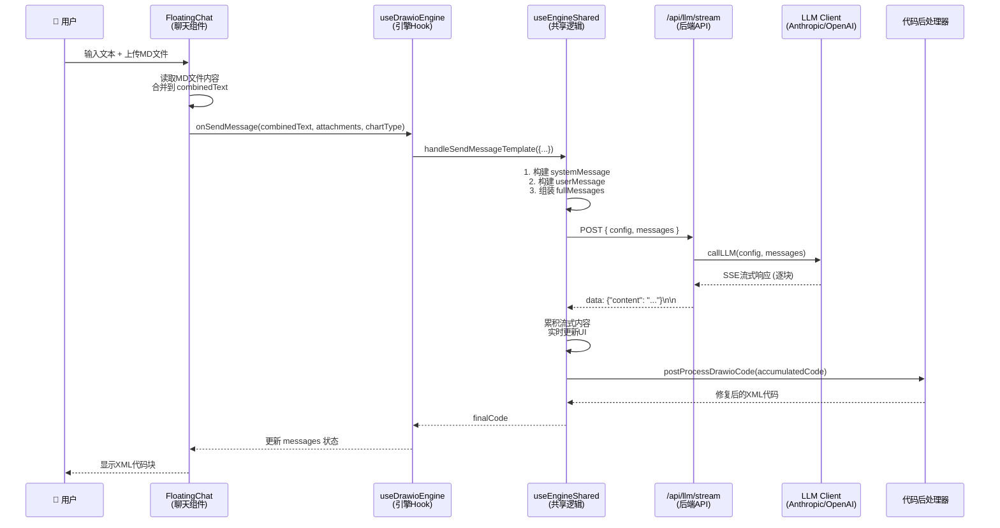

# Smart Draw 数据流链路分析

> 本文档详细分析了 Smart Draw 从用户输入（聊天框文本 + 上传文件）到 LLM 生成图表代码的完整数据流链路。

## 目录

- [概述](#概述)
- [完整数据流时序图](#完整数据流时序图)
- [逐层详解](#逐层详解)
  - [第一层：用户输入入口](#第一层用户输入入口-floatingchatjsx)
  - [第二层：引擎层处理](#第二层引擎层处理-usedrawioenginejs--useenginesharedjs)
  - [第三层：消息数组构建](#第三层消息数组构建-useenginesharedjs)
  - [第四层：系统提示词](#第四层系统提示词-libpromptsdrawiojs)
  - [第五层：API 请求](#第五层api-请求-useenginesharedjs)
  - [第六层：后端 API 路由](#第六层后端-api-路由-appapillmstreamroutejs)
  - [第七层：LLM 客户端调用](#第七层llm-客户端调用-libllm-clientjs)
  - [第八层：流式响应与代码后处理](#第八层流式响应与代码后处理)
- [数据变换可视化](#数据变换可视化)
- [关键设计要点总结](#关键设计要点总结)
- [附录：关键代码文件索引](#附录关键代码文件索引)

---

## 概述

当用户在聊天框输入如"请根据以上两份文件绘制信息图"并上传 MD 文件后，系统会经历以下主要阶段：

1. **输入收集**：聊天组件收集用户文本和上传文件
2. **内容合并**：MD/TXT 文件内容被读取并合并到用户输入中
3. **消息构建**：引擎层构建包含系统提示词、历史消息和用户消息的完整消息数组
4. **API 调用**：通过后端代理调用 LLM API（支持 Anthropic/OpenAI）
5. **流式响应**：通过 SSE (Server-Sent Events) 实时返回 LLM 输出
6. **代码后处理**：清洗、提取、修复生成的 XML/JSON 代码
7. **结果展示**：在聊天面板显示代码，用户可应用到画布

---

## 完整数据流时序图



---

## 逐层详解

### 第一层：用户输入入口 (FloatingChat.jsx)

**文件位置**：`components/FloatingChat.jsx`

当用户在聊天框输入文本并上传文件时，`handleSend` 函数负责处理所有输入：

```javascript
const handleSend = async () => {
  if ((input.trim() === '' && images.length === 0 && files.length === 0) || isGenerating) return;

  // 读取文本文件内容的辅助函数
  const readText = (file) => new Promise((resolve) => {
    try {
      const reader = new FileReader();
      reader.onload = () => resolve(typeof reader.result === 'string' ? reader.result : '');
      reader.onerror = () => resolve('');
      reader.readAsText(file);
    } catch (e) {
      resolve('');
    }
  });

  const typedText = input.trim();
  let combinedText = typedText;

  // 🔑 关键：文件内容并入到 combinedText
  if (files.length > 0) {
    const texts = await Promise.all(files.map(({ file, name }) =>
      readText(file).then(t => ({ name, text: t }))
    ));
    const parts = texts
      .map(({ name, text }) => {
        const safe = (text || '').toString();
        if (!safe) return '';
        return `# 来自文件: ${name}\n\n${safe}`;
      })
      .filter(Boolean);
    if (parts.length) {
      combinedText = [combinedText, ...parts].filter(Boolean).join('\n\n');
    }
  }

  // 🔑 关键：构建附件数组，区分图片和文件
  const attachments = [
    ...images.map(({ file, type, name }) => ({
      file, type, name, kind: 'image',
      url: URL.createObjectURL(file)
    })),
    ...files.map(({ file, name, type, size }) => ({
      file, name, type, size, kind: 'file'
    }))
  ];

  // 📤 关键：调用引擎的 handleSendMessage，传递综合数据
  onSendMessage(combinedText, attachments, chartType);

  // 清理状态
  setInput('');
  images.forEach(img => img.url && URL.revokeObjectURL(img.url));
  setImages([]);
  setFiles([]);
};
```

#### 数据结构说明

**combinedText（合并后的文本）**：
```
用户输入文本

# 来自文件: requirements.md

文件1的完整内容...

# 来自文件: design.md

文件2的完整内容...
```

**attachments（附件数组）**：
```javascript
[
  {
    file: File,
    type: "image/png",
    name: "diagram.png",
    kind: "image",
    url: "blob:http://..."
  },
  {
    file: File,
    name: "spec.md",
    type: "text/markdown",
    size: 12345,
    kind: "file"
  }
]
```

> **重要说明**：MD/TXT 等文本文件的内容会被读取并直接合并到 `combinedText` 中，而不是作为二进制附件传递。只有图片文件才会作为多模态附件处理。

---

### 第二层：引擎层处理 (useDrawioEngine.js → useEngineShared.js)

**文件位置**：
- `hooks/useDrawioEngine.js`
- `hooks/useEngineShared.js`

#### 2.1 handleSendMessage 入口

```javascript
// useDrawioEngine.js
const handleSendMessage = useCallback(
  async (input, attachments = [], chartType = 'auto', _unusedConfig, showNotification) => {
    try {
      // 🔑 调用模板方法，传递 Draw.io 特定配置
      await handleSendMessageTemplate({
        input,                          // 合并的文本内容
        attachments,                    // 图片/文件附件
        chartType,                      // 'flowchart', 'mindmap' 等
        systemPrompt: SYSTEM_PROMPT,    // Draw.io 特定的系统提示词
        userPromptTemplate: USER_PROMPT_TEMPLATE,  // 用户提示词模板函数
        postProcessFn: postProcessDrawioCode,      // 后处理函数
        editor: 'drawio',               // 引擎标识
        showNotification,
      });
    } catch (error) {
      console.error('Draw.io message send error:', error);
    }
  },
  [handleSendMessageTemplate, postProcessDrawioCode]
);
```

#### 2.2 buildUserMessage - 多模态消息构建

```javascript
// useEngineShared.js
const buildUserMessage = useCallback(
  async (textContent, attachments = []) => {
    const userMessage = {
      role: 'user',
      content: textContent,  // 先设置纯文本
    };

    // 处理图片附件
    if (Array.isArray(attachments) && attachments.length > 0) {
      const imageAttachments = attachments.filter(
        (att) => att.kind === 'image',
      );
      if (imageAttachments.length > 0) {
        // 🔑 关键：将图片转为 base64
        const encodedImages = await Promise.all(
          imageAttachments.map(async ({ file, type, name }) => ({
            data: await fileToBase64(file),  // File → base64
            mimeType: (file && file.type) || type || 'image/png',
            name: (file && file.name) || name || 'image',
          })),
        );

        const safeImages = encodedImages.filter((img) => !!img.data);

        if (safeImages.length > 0) {
          // 🔑 转换为多模态消息格式
          userMessage.content = [
            { type: 'text', text: textContent },
            ...safeImages.map((img) => ({
              type: 'image_url',
              image_url: {
                url: `data:${img.mimeType};base64,${img.data}`,
              },
            })),
          ];

          // 保存独立的 imagePayloads，供 LLM 客户端序列化
          userMessage.imagePayloads = safeImages.map((img) => ({
            data: img.data,
            mimeType: img.mimeType,
            name: img.name,
          }));
        }
      }
    }

    return userMessage;
  },
  [fileToBase64],
);
```

#### 生成的 userMessage 格式

**纯文本消息**（无图片附件）：
```javascript
{
  role: 'user',
  content: '用户需求：\n"请根据以上两份文件绘制信息图\n\n# 来自文件: req.md\n\n内容..."\n\n图表类型："信息图"'
}
```

**多模态消息**（有图片附件）：
```javascript
{
  role: 'user',
  content: [
    { type: 'text', text: '用户需求：\n"..."' },
    { type: 'image_url', image_url: { url: 'data:image/png;base64,iVBORw0KG...' } }
  ],
  imagePayloads: [
    {
      data: 'iVBORw0KG...',
      mimeType: 'image/png',
      name: 'diagram.png'
    }
  ]
}
```

---

### 第三层：消息数组构建 (useEngineShared.js)

#### 3.1 buildFullMessages - 组装完整消息

```javascript
// useEngineShared.js
const buildFullMessages = useCallback(
  (systemMessage, userMessage, currentMessages, historyLimit = 3) => {
    // 🔑 筛选历史消息：只保留 user 和 assistant，且 content 为字符串
    const history = currentMessages
      .filter(
        (m) =>
          ['user', 'assistant'].includes(m.role) &&
          typeof m.content === 'string',  // 排除多模态消息（content 为数组）
      )
      .slice(-historyLimit);  // 只保留最近 3 条

    return [systemMessage, ...history, userMessage];
  },
  [],
);
```

#### 3.2 handleSendMessageTemplate - 完整流程

```javascript
// useEngineShared.js
const handleSendMessageTemplate = useCallback(
  async ({
    input,
    attachments = [],
    chartType = 'auto',
    systemPrompt,
    userPromptTemplate,
    postProcessFn,
    sseParserFn = parseSSEStream,
    editor,
    showNotification,
  }) => {
    try {
      setIsGenerating(true);
      setStreamingContent('');
      setLastError(null);

      // ========== 步骤 1：验证配置 ==========
      const llmConfig = validateConfig(showNotification);
      if (!llmConfig) return;

      // ========== 步骤 2：构建系统消息 ==========
      const systemMessage = {
        role: 'system',
        content: systemPrompt,  // Draw.io 的系统提示词
      };

      // ========== 步骤 3：构建用户消息 ==========
      // 应用用户提示词模板
      const userContent = userPromptTemplate(input, chartType);
      // 构建多模态消息（包含图片）
      const userMessage = await buildUserMessage(userContent, attachments);

      // ========== 步骤 4：组装完整 messages ==========
      const fullMessages = buildFullMessages(systemMessage, userMessage, messages, 3);

      // ========== 步骤 5：保存消息到历史 ==========
      setMessages((prev) => [...prev, userMessage]);
      await historyManager.addMessage(conversationId, userMessage, editor, llmConfig, chartType);

      // ========== 步骤 6：调用 LLM 流式接口 ==========
      const response = await callLLMStream(llmConfig, fullMessages);

      // ========== 步骤 7：处理 SSE 流 ==========
      const accumulatedCode = await sseParserFn(response, {
        onChunk: (content) => setStreamingContent(content),  // 实时更新 UI
      });

      // ========== 步骤 8：后处理代码 ==========
      setStreamingContent('');
      const finalCode = postProcessFn(accumulatedCode);

      // ========== 步骤 9：保存 AI 回复 ==========
      const assistantMessage = {
        role: 'assistant',
        content: finalCode,
      };

      setMessages((prev) => [...prev, assistantMessage]);
      await historyManager.addMessage(conversationId, assistantMessage, editor, llmConfig, chartType);

      return finalCode;
    } catch (error) {
      // 错误处理...
    } finally {
      setIsGenerating(false);
    }
  },
  [...]
);
```

#### 完整的 fullMessages 数组示例

```javascript
[
  {
    role: 'system',
    content: '你是 Draw.io 图表生成助手...'  // SYSTEM_PROMPT（约 5000+ 字符）
  },
  // ← 历史消息（如果有，最多 3 条）
  {
    role: 'user',
    content: '用户需求：\n"请画一个登录流程图"\n\n图表类型："流程图"'
  },
  {
    role: 'assistant',
    content: '<mxfile>...</mxfile>'
  },
  // ← 当前用户消息
  {
    role: 'user',
    content: '用户需求：\n"请根据以上两份文件绘制信息图\n\n# 来自文件: req.md\n\n..."\n\n图表类型："信息图"'
  }
]
```

---

### 第四层：系统提示词 (lib/prompts/drawio.js)

**文件位置**：`lib/prompts/drawio.js`

#### 4.1 SYSTEM_PROMPT 内容结构

系统提示词包含以下主要部分：

1. **核心任务定义**：生成 mxGraph XML 格式的 Draw.io 图表
2. **XML 语法规范**：
   - 文档结构：`<mxfile>` → `<diagram>` → `<mxGraphModel>` → `<root>`
   - 标签闭合规则（自闭合 vs 配对）
   - mxCell 元素规范（节点 vs 连线）
3. **图表类型规范**：23 种图表类型的布局规范
4. **布局规范**：尺寸标准、坐标计算、防重叠
5. **视觉规范**：配色方案、动画连线等

#### 4.2 USER_PROMPT_TEMPLATE 构建

```javascript
// lib/prompts/drawio.js
export const USER_PROMPT_TEMPLATE = (userInput, chartType = 'auto') => {
  const trimmed = (userInput || '').trim();
  const key = chartType || 'auto';
  const label = CHART_TYPE_LABELS[key] || key;

  return `用户需求：\n"${trimmed}"\n\n图表类型："${label}"`;
};

// 示例输出：
// 用户需求：
// "请根据以上两份文件绘制信息图
//
// # 来自文件: requirements.md
//
// ## 功能需求
// 1. 用户登录
// 2. 数据管理
// ...
//
// # 来自文件: design.md
//
// ## 架构设计
// - 前端: React
// - 后端: Node.js
// ..."
//
// 图表类型："信息图"
```

---

### 第五层：API 请求 (useEngineShared.js)

#### 5.1 callLLMStream - 构建 POST 请求

```javascript
// useEngineShared.js
const callLLMStream = useCallback(async (llmConfig, fullMessages) => {
  const headers = {
    'Content-Type': 'application/json',
  };

  // 检查是否使用访问密码模式
  if (typeof window !== 'undefined') {
    try {
      const usePassword =
        localStorage.getItem('smart-diagram-use-password') === 'true';
      const accessPassword =
        localStorage.getItem('smart-diagram-access-password') || '';
      if (usePassword && accessPassword) {
        // 🔑 密码模式：通过请求头传递 password
        headers['x-access-password'] = accessPassword;
      }
    } catch {
      // ignore
    }
  }

  // 构建请求体
  const isPasswordMode =
    typeof window !== 'undefined' &&
    localStorage.getItem('smart-diagram-use-password') === 'true';

  const requestBody = isPasswordMode
    ? { messages: fullMessages }  // 密码模式：不传 config
    : { config: llmConfig, messages: fullMessages };  // 本地模式：传 config

  const response = await fetch('/api/llm/stream', {
    method: 'POST',
    headers,
    body: JSON.stringify(requestBody),
  });

  if (!response.ok) {
    // 错误处理...
    throw error;
  }

  return response;
}, []);
```

#### 请求体示例

**本地配置模式**：
```json
{
  "config": {
    "type": "anthropic",
    "baseUrl": "https://api.anthropic.com/v1",
    "apiKey": "sk-ant-...",
    "model": "claude-sonnet-4-5-20250929"
  },
  "messages": [
    {
      "role": "system",
      "content": "你是 Draw.io 图表生成助手..."
    },
    {
      "role": "user",
      "content": "用户需求：\n\"请根据以上两份文件绘制信息图\n\n# 来自文件: req.md\n\n...\"\n\n图表类型：\"信息图\""
    }
  ]
}
```

**访问密码模式**：
```json
{
  "messages": [...]
}
// + Header: x-access-password: your-password
```

---

### 第六层：后端 API 路由 (app/api/llm/stream/route.js)

**文件位置**：`app/api/llm/stream/route.js`

```javascript
export async function POST(request) {
  try {
    const { config, messages } = await request.json();
    const accessPassword = request.headers.get('x-access-password') || '';
    const usingPassword = !!accessPassword;

    // 基本参数校验
    if (!messages || !Array.isArray(messages)) {
      return NextResponse.json(
        { error: 'Missing required parameters: messages' },
        { status: 400 },
      );
    }

    let finalConfig = null;

    if (usingPassword) {
      // ========== 访问密码模式 ==========
      const envPassword = process.env.ACCESS_PASSWORD;
      if (!envPassword) {
        return NextResponse.json(
          { error: '服务器未配置访问密码' },
          { status: 400 },
        );
      }

      if (accessPassword !== envPassword) {
        return NextResponse.json(
          { error: '访问密码错误' },
          { status: 401 },
        );
      }

      // 🔑 从环境变量读取 LLM 配置
      const serverConfig = {
        type: process.env.SERVER_LLM_TYPE,          // 'anthropic'
        baseUrl: process.env.SERVER_LLM_BASE_URL,   // 'https://api.anthropic.com/v1'
        apiKey: process.env.SERVER_LLM_API_KEY,     // 'sk-ant-...'
        model: process.env.SERVER_LLM_MODEL,        // 'claude-sonnet-4-5-20250929'
      };

      if (!serverConfig.type || !serverConfig.apiKey) {
        return NextResponse.json(
          { error: '服务器端 LLM 配置不完整' },
          { status: 500 },
        );
      }

      finalConfig = serverConfig;
    } else {
      // ========== 本地配置模式 ==========
      if (!config) {
        return NextResponse.json(
          { error: 'Missing required parameter: config' },
          { status: 400 },
        );
      }

      if (!config.type || !config.apiKey) {
        return NextResponse.json(
          { error: 'Invalid config: missing type or apiKey' },
          { status: 400 },
        );
      }

      finalConfig = config;
    }

    // ========== 创建 SSE 流 ==========
    const encoder = new TextEncoder();
    const stream = new ReadableStream({
      async start(controller) {
        try {
          // 调用 LLM 客户端
          await callLLM(finalConfig, messages, (chunk) => {
            // 🔑 逐块推送 SSE 数据
            const data = `data: ${JSON.stringify({ content: chunk })}\n\n`;
            controller.enqueue(encoder.encode(data));
          });

          // 发送完成信号
          controller.enqueue(encoder.encode('data: [DONE]\n\n'));
          controller.close();
        } catch (error) {
          console.error('Error in stream:', error);
          const errorData = `data: ${JSON.stringify({ error: error.message })}\n\n`;
          controller.enqueue(encoder.encode(errorData));
          controller.close();
        }
      },
    });

    return new Response(stream, {
      headers: {
        'Content-Type': 'text/event-stream',
        'Cache-Control': 'no-cache',
        'Connection': 'keep-alive',
      },
    });
  } catch (error) {
    console.error('Error in /api/llm/stream:', error);
    return NextResponse.json(
      { error: error.message || 'Failed to stream LLM response' },
      { status: 500 },
    );
  }
}
```

---

### 第七层：LLM 客户端调用 (lib/llm-client.js)

**文件位置**：`lib/llm-client.js`

#### 7.1 callLLM 入口点

```javascript
export async function callLLM(config, messages, onChunk) {
  const { type, baseUrl, apiKey, model } = config;

  if (type === 'openai') {
    return callOpenAI(baseUrl, apiKey, model, messages, onChunk);
  } else if (type === 'anthropic') {
    return callAnthropic(baseUrl, apiKey, model, messages, onChunk);
  } else {
    throw new Error(`Unsupported provider type: ${type}`);
  }
}
```

#### 7.2 callAnthropic - Anthropic API 适配

```javascript
async function callAnthropic(baseUrl, apiKey, model, messages, onChunk) {
  const url = `${baseUrl}/messages`;

  // 🔑 分离系统消息
  const systemMessage = messages.find(m => m.role === 'system');
  const chatMessages = messages.filter(m => m.role !== 'system');

  // 🔑 多模态处理：将消息格式转换为 Anthropic 格式
  const processedMessages = chatMessages.map(processMessageForAnthropic);

  const response = await fetch(url, {
    method: 'POST',
    headers: {
      'Content-Type': 'application/json',
      'x-api-key': apiKey,
      'anthropic-version': '2023-06-01',
    },
    body: JSON.stringify({
      model,
      messages: processedMessages,
      system: systemMessage ? [{ type: 'text', text: systemMessage.content }] : undefined,
      max_tokens: 64000,
      stream: true,
      temperature: 1,
    }),
  });

  if (!response.ok) {
    const error = await response.text();
    throw new Error(`Anthropic API error: ${response.status} ${error}`);
  }

  // 处理流式响应
  return processAnthropicStream(response.body, onChunk);
}
```

#### 7.3 多模态消息转换 - processMessageForAnthropic

```javascript
function processMessageForAnthropic(message) {
  const role = message.role === 'assistant' ? 'assistant' : 'user';

  // 🔑 提取文本部分
  const textParts = extractTextPartsForAnthropic(message);

  // 🔑 提取图像 payload
  const imagePayloads = extractImagePayloads(message);

  // 🔑 将图像转换为 Anthropic 格式
  const imageParts = imagePayloads.map((img) => createAnthropicImagePart(img)).filter(Boolean);

  const content = [...textParts, ...imageParts];

  if (content.length === 0) {
    content.push({ type: 'text', text: '' });
  }

  return {
    role,
    content,
  };
}
```

**转换后的 Anthropic 消息格式**：
```javascript
{
  role: 'user',
  content: [
    { type: 'text', text: '用户需求：\n"..."' },
    {
      type: 'image',
      source: {
        type: 'base64',
        media_type: 'image/png',
        data: 'iVBORw0KG...'
      }
    }
  ]
}
```

#### 7.4 处理 Anthropic 流式响应

```javascript
async function processAnthropicStream(body, onChunk) {
  const reader = body.getReader();
  const decoder = new TextDecoder();
  let fullText = '';
  let buffer = '';

  try {
    while (true) {
      const { done, value } = await reader.read();
      if (done) break;

      buffer += decoder.decode(value, { stream: true });
      const lines = buffer.split('\n');
      buffer = lines.pop() || '';

      for (const line of lines) {
        const trimmed = line.trim();
        if (!trimmed || !trimmed.startsWith('data: ')) continue;

        try {
          const json = JSON.parse(trimmed.slice(6));

          // 🔑 提取流式文本内容
          if (json.type === 'content_block_delta') {
            const content = json.delta?.text;
            if (content) {
              fullText += content;
              // 🔑 调用回调函数，实时推送到前端
              if (onChunk) onChunk(content);
            }
          }
        } catch (e) {
          console.error('Failed to parse SSE:', e);
        }
      }
    }
  } finally {
    reader.releaseLock();
  }

  return fullText;  // 返回累积的完整响应
}
```

#### Anthropic SSE 流格式示例

```
data: {"type":"message_start","message":{"id":"msg-...","content":[]}}

data: {"type":"content_block_start","index":0,"content_block":{"type":"text"}}

data: {"type":"content_block_delta","index":0,"delta":{"type":"text_delta","text":"<mxfile>"}}

data: {"type":"content_block_delta","index":0,"delta":{"type":"text_delta","text":"\n  <diagram>"}}

data: {"type":"content_block_delta","index":0,"delta":{"type":"text_delta","text":"\n    ..."}}

...

data: {"type":"message_delta","delta":{"stop_reason":"end_turn"}}

data: {"type":"message_stop"}
```

---

### 第八层：流式响应与代码后处理

#### 8.1 SSE 解析

```javascript
// useEngineShared.js
const accumulatedCode = await sseParserFn(response, {
  onChunk: (content) => setStreamingContent(content),  // 实时更新聊天面板
});
```

#### 8.2 代码后处理 - postProcessDrawioCode

```javascript
// useDrawioEngine.js
const postProcessDrawioCode = useCallback((code) => {
  return drawioProcessor.process(code);  // 使用处理管道
}, []);
```

#### drawioProcessor 处理管道

处理管道按顺序执行以下步骤：

1. **cleanBOM** - 清理 BOM 和零宽字符
2. **extractCodeFence('xml')** - 提取 `` ```xml ... ``` `` 代码块内容
3. **unescapeHTML** - HTML 反转义
4. **extractXML** - 提取 `<mxfile>` 主体
5. **normalizeMxTags** - 标准化标签大小写
6. **fixXML** - 修复未闭合标签（由 `lib/fixUnclosed.js` 处理）

#### LLM 原始输出 vs 处理后输出

**LLM 原始输出**：
```
根据您提供的两份文档，我为您绘制了信息图：

```xml
<mxfile host="app.diagrams.net" modified="2024-01-01T00:00:00.000Z">
  <diagram name="信息图" id="xxx">
    <mxGraphModel dx="1000" dy="600" grid="1">
      <root>
        <mxCell id="0" />
        <mxCell id="1" parent="0" />
        <mxCell id="2" value="用户登录" style="rounded=1;..." vertex="1" parent="1">
          <mxGeometry x="100" y="50" width="120" height="60" as="geometry" />
        </mxCell>
        ...
      </root>
    </mxGraphModel>
  </diagram>
</mxfile>
```

希望这个图表能满足您的需求！
```

**处理后的 finalCode**：
```xml
<mxfile host="app.diagrams.net" modified="2024-01-01T00:00:00.000Z">
  <diagram name="信息图" id="xxx">
    <mxGraphModel dx="1000" dy="600" grid="1">
      <root>
        <mxCell id="0" />
        <mxCell id="1" parent="0" />
        <mxCell id="2" value="用户登录" style="rounded=1;..." vertex="1" parent="1">
          <mxGeometry x="100" y="50" width="120" height="60" as="geometry" />
        </mxCell>
        ...
      </root>
    </mxGraphModel>
  </diagram>
</mxfile>
```

---

## 数据变换可视化

```
┌─────────────────────────────────────────────────────────────────────┐
│                           用户输入                                   │
│  文本: "请根据以上两份文件绘制信息图"                                │
│  文件: [requirements.md, design.md]                                 │
└─────────────────────────────┬───────────────────────────────────────┘
                              │ ① 文件读取 & 合并
                              ▼
┌─────────────────────────────────────────────────────────────────────┐
│                        combinedText                                  │
│  "请根据以上两份文件绘制信息图                                       │
│                                                                      │
│   # 来自文件: requirements.md                                        │
│   ## 功能需求                                                        │
│   1. 用户登录...                                                     │
│                                                                      │
│   # 来自文件: design.md                                              │
│   ## 架构设计                                                        │
│   - 前端: React..."                                                  │
└─────────────────────────────┬───────────────────────────────────────┘
                              │ ② 应用用户提示词模板
                              ▼
┌─────────────────────────────────────────────────────────────────────┐
│                        userMessage                                   │
│  {                                                                   │
│    role: 'user',                                                     │
│    content: '用户需求：\n"请根据以上两份文件..."\n\n图表类型："信息图"'│
│  }                                                                   │
└─────────────────────────────┬───────────────────────────────────────┘
                              │ ③ 组装完整消息数组
                              ▼
┌─────────────────────────────────────────────────────────────────────┐
│                       fullMessages                                   │
│  [                                                                   │
│    { role: 'system', content: 'Draw.io系统提示词...' },             │
│    { role: 'user', content: '用户需求：\n"..."' }                    │
│  ]                                                                   │
└─────────────────────────────┬───────────────────────────────────────┘
                              │ ④ POST /api/llm/stream
                              ▼
┌─────────────────────────────────────────────────────────────────────┐
│                    Anthropic API 调用                                │
│  model: claude-sonnet-4-5-20250929                                  │
│  stream: true                                                        │
│  max_tokens: 64000                                                   │
└─────────────────────────────┬───────────────────────────────────────┘
                              │ ⑤ SSE 流式响应
                              ▼
┌─────────────────────────────────────────────────────────────────────┐
│                     LLM 原始输出 (流式累积)                          │
│  "根据您提供的两份文档，我为您绘制了信息图：                          │
│                                                                      │
│   ```xml                                                             │
│   <mxfile host="..." ...>                                           │
│     <diagram name="信息图" id="...">                                 │
│       <mxGraphModel ...>                                            │
│         <root>                                                       │
│           <mxCell id="0"/>                                          │
│           ...                                                        │
│         </root>                                                      │
│       </mxGraphModel>                                                │
│     </diagram>                                                       │
│   </mxfile>                                                          │
│   ```"                                                               │
└─────────────────────────────┬───────────────────────────────────────┘
                              │ ⑥ 代码后处理
                              ▼
┌─────────────────────────────────────────────────────────────────────┐
│                      finalCode (纯净XML)                             │
│  <mxfile host="..." ...>                                            │
│    <diagram name="信息图" id="...">                                  │
│      <mxGraphModel ...>                                             │
│        <root>                                                        │
│          <mxCell id="0"/>                                           │
│          <mxCell id="1" parent="0"/>                                │
│          <mxCell id="2" value="用户登录" style="..." vertex="1"...>  │
│            <mxGeometry x="100" y="50" width="120" height="60" .../>  │
│          </mxCell>                                                   │
│          ...                                                         │
│        </root>                                                       │
│      </mxGraphModel>                                                 │
│    </diagram>                                                        │
│  </mxfile>                                                           │
└─────────────────────────────────────────────────────────────────────┘
```

---

## 关键设计要点总结

| 环节 | 发生的事情 | 关键代码位置 |
|------|-----------|-------------|
| **文件合并** | MD/TXT 文件内容被读取为文本，和用户输入合并成 combinedText | `components/FloatingChat.jsx:137-181` |
| **提示词模板** | 应用 `USER_PROMPT_TEMPLATE` 格式化用户输入，添加图表类型标签 | `lib/prompts/drawio.js:163-169` |
| **多模态处理** | 图片转为 base64 编码，构建多模态消息结构 | `hooks/useEngineShared.js:54-101` |
| **消息组装** | system + history(最多3条) + user 组成完整消息数组 | `hooks/useEngineShared.js:111-124` |
| **两种模式** | 本地配置模式 vs 访问密码模式，决定 config 的传递方式 | `hooks/useEngineShared.js:132-185` |
| **配置验证** | 后端验证密码或配置有效性，获取最终的 LLM 配置 | `app/api/llm/stream/route.js:13-78` |
| **LLM 适配** | 将通用消息格式转换为 Anthropic/OpenAI 特定格式 | `lib/llm-client.js:215-231` |
| **流式响应** | 通过 SSE 实时推送 LLM 输出，前端通过 streamingContent 更新 UI | `lib/llm-client.js:137-176` |
| **后处理管道** | 清理 BOM、提取代码块、修复未闭合标签、标准化格式 | `lib/code-processor.js` |

---

## 附录：关键代码文件索引

| 文件路径 | 职责 | 关键函数/导出 |
|---------|------|--------------|
| `components/FloatingChat.jsx` | 用户输入入口 | `handleSend()` |
| `hooks/useEngine.js` | 引擎选择器 | 根据 engineType 返回对应引擎 |
| `hooks/useDrawioEngine.js` | Draw.io 引擎 | `handleSendMessage()`, `postProcessDrawioCode()` |
| `hooks/useExcalidrawEngine.js` | Excalidraw 引擎 | `handleSendMessage()`, `postProcessExcalidrawCode()` |
| `hooks/useEngineShared.js` | 共享引擎逻辑 | `handleSendMessageTemplate()`, `buildUserMessage()`, `buildFullMessages()`, `callLLMStream()` |
| `lib/prompts/drawio.js` | Draw.io 提示词 | `SYSTEM_PROMPT`, `USER_PROMPT_TEMPLATE()` |
| `lib/prompts/excalidraw.js` | Excalidraw 提示词 | `SYSTEM_PROMPT`, `USER_PROMPT_TEMPLATE()` |
| `app/api/llm/stream/route.js` | 后端 API 路由 | `POST()` |
| `lib/llm-client.js` | LLM 客户端 | `callLLM()`, `callAnthropic()`, `callOpenAI()` |
| `lib/code-processor.js` | 代码处理器 | `createCodeProcessor()`, 各种处理函数 |
| `lib/fixUnclosed.js` | XML/JSON 修复 | `fixXML()`, `fixJSON()` |
| `lib/optimizeArrows.js` | Excalidraw 箭头优化 | `optimizeExcalidrawCode()` |

---

## 更新记录

| 日期 | 更新内容 |
|------|---------|
| 2024-12-15 | 初始版本，完整记录数据流链路分析 |
